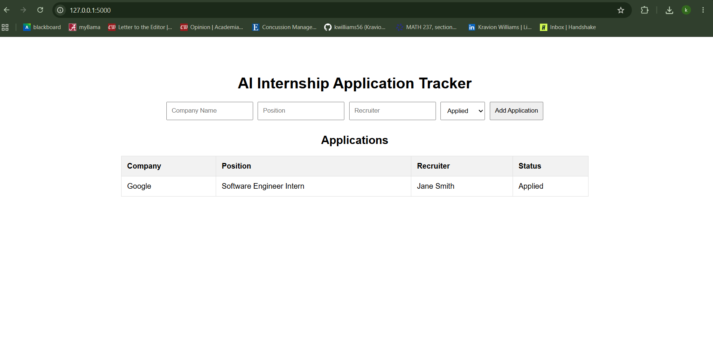

# AI Internship Application Tracker

A web application built with Flask, Python, SQLite, HTML, and CSS to help students track internship applications, recruiters, and application statuses.

## Features

- Add internship applications
- Edit application details
- Delete applications
- Search by company name
- Track application dates
- Monitor application status
- Dashboard statistics
- SQLite database integration
- Flask web application
- 
## Technologies Used

- Python
- Flask
- SQLite
- HTML
- CSS

## Screenshots



## Installation

1. Clone the repository:

```bash
git clone https://github.com/kwilliams56/AI-Internship-Tracker.git
```

2. Navigate to the project folder:

```bash
cd AI-Internship-Tracker
```

3. Install Flask:

```bash
pip install flask
```

4. Run the application:

```bash
python app.py
```

5. Open your browser and go to:

```text
http://127.0.0.1:5000
```

## Future Improvements

- Edit applications
- Delete applications
- Search and filter applications
- Dashboard analytics
- Email reminders
- User authentication

## Author

**Kravion Williams**

Computer Science Student  
University of Alabama

GitHub: https://github.com/kwilliams56
